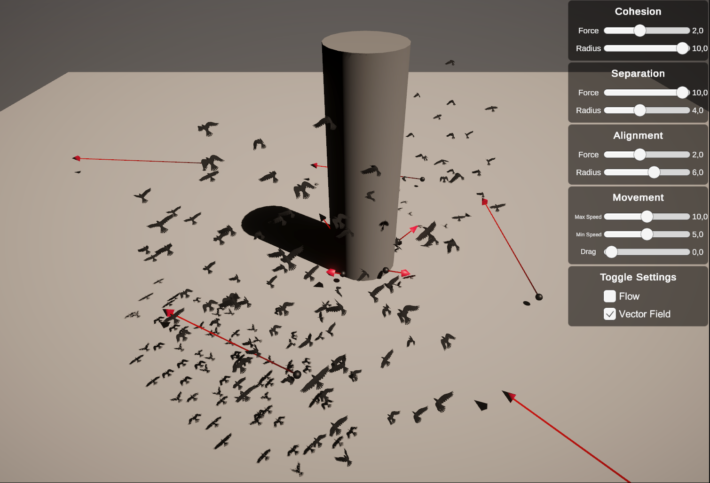

# Interactive Boid Authoring via LLM-Controlled RBF Flow Fields - DH2323 Final project at KTH

### **Abstract**

Simulating crowd behaviour is a longstanding challenge in computer graphics, with methods like Reynolds’ Boids and RBF flow fields providing scalable, real-time control. Recent work by [Giraldo](https://github.com/DavidGiraldoCode/p-authoring_boids_RBF_interpolation) extended RBF fields to 3D but also highlighted the lack of intuitive user control, limiting creative flexibility. This project aims to extend the work of Giraldo by building an interactive system where users direct crowd motion using natural language, enabling designers to author complex agent behaviours without tedious, manual parameter tuning.

Adding to Giraldo’s Boids with RBF interpolation, we implement an LLM-driven control layer. Natural-language commands are parsed by a local LLM that responds with structured JSON directives that adjust Boid parameters and flow-field source vectors on the fly in Unity. A visual debug interface and scene-aware prompting support intuitive feedback and control.

It is concluded that combining language-based input support with classic crowd simulation techniques offers a promising pathway toward more accessible and expressive tools for motion design and interactive animation. The project delivers a base for further implementation, interested parties can find the full project and assets online.

# Getting Started

Follow the steps below to run the project.

## Prerequisites

- [Unity 6000.0.48f1](https://unity.com)
- [Ollama](https://ollama.com/) (if you want to use a locally hosted model)
- [OpenAI API Key](https://platform.openai.com/api-keys) (if you want to use a cloud-based model)

## Installation

### 1. Clone the repository

```bash
git clone git@github.com:sasoder/authoring-RBF-boids-with-LLM.git
```

### 2. Create a .env file in the llm-server directory

The example file is populated with sensible defaults. Feel free to change the values to your liking.

```bash
cp llm-server/.env.example llm-server/.env
```

### 3. Build and run the ollama + whisper server

```bash
# create a virtual environment
python -m venv venv
source venv/bin/activate
# install dependencies
pip install -r requirements.txt
# run the server
fastapi dev main.py
```

```bash
#For Windows:
# create a virtual environment
py -m venv venv
.\venv\Scripts\activate.bat
# install dependencies - comment out uvloop from requirements.txt before
pip install -r requirements.txt
# run the server
fastapi dev main.py
```

### 4. Open the project in Unity.

There are several different scenes available testing different scenarios.

### 5. Run the project.

# Implementation

This study’s implementation introduces an approach that combines Jin’s flow field with Raynolds’ Boids algorithm, aiming to create a more plausible and visually appealing result for bird-like agents. The system ensures that the Boids maintain a balanced distance from each other, avoiding both excessive spreading and collisions while following a predefined path. The simulation used C# in Unity 2022.3 LTS without the use of any additional package or third-party API.

## Process and updates highlights

**2025 May 14**

You can select which models to use for the LLM, the UI design definitely has room for improvement, but it's functional!


**2025 May 11**

We implemented the option to use cloud-based models for the LLM and have experimented with some of the newer models provided by OpenAI. The inference speed is much faster, and the quality of the generated vectors is noticably better. API delay is negligible.

**2025 May 10**

We decided to go with a simple json scene representation for the objects ditching the bounding boxes as we overestimated the ability of the locally hosted models to generate reasonable vector fields. We're experimenting with pre-defined vector templates that the LLM can select from rather than forcing it to generate a vector field from scratch. It seems to be working well, and fits the use case a bit better. You can select which GameObjects should be included in the scene representation by giving them the `LLMPrompt` tag, which makes the prompts much more concise, and allows the developer to specify actually relevant objects. Also created a simple test environment with some of the objects tagged.


**2025 May 09**

Currently, we have defined a few different underlying behaviour templates that the LLM selects from to generate a steering behaviour for the boids. We are quickly iterating on the grammar of the LLM output - the goal is to have a concise way to represent both the scene and any other important context that the LLM should take into account. Including not only the object origins, but also bounds should allow the LLM to generate fitting vectors for the boids.

**2025 May 05**

We have now implemented the style interface that controls the steering behavior of the boids! This will allow us to author different steering behaviors for the boids manually, and more easily be able to test and iterate on them.



**2025 April 30**

Running ollama and whisper within the container itself led to some issues, so we decided to ditch the docker container and run the server locally. Initially, the docker container was meant to be an easy way to run the server without having to install the dependencies, but it ended up causing more problems than it solved. We attempted to have the container communicate with the host machine for the inference, but at that point it was easier to just run the server locally. There are easy-to-use python packages for this, so we decided to go with that.

**2025 April 28**

We started by implementing basic communication between Unity and the LLM server, along with transcription of audio to text. This was done by creating an `LLMManager` script set up in a prefab for easy reuse. The script is responsible for the communication with a local FastAPI server that runs in a docker container that on first run will download the whisper and ollama model specified in the .env file.


## References

Pulsar Bytes provided the bird mesh at the Unity Assets Store. Sound provided by SilentSeason at freesound.com. Environment used is [Low Poly Environment](https://assetstore.unity.com/packages/3d/environments/low-poly-environment-315184) provided by Sky Den Games.
